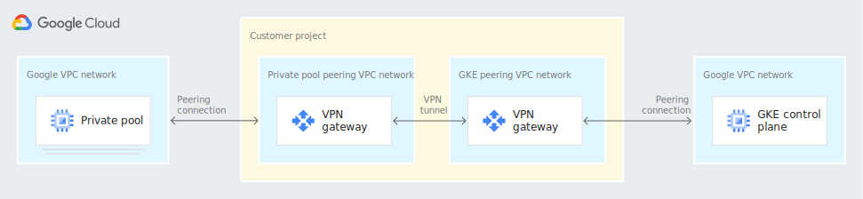

# Full CICD Pipeline with Cloud Build accessing Private GKE Cluster

The following repo sets up a GCP architecture where Cloud Build is used as CI/CD tool for deploying workloads to a private GKE cluster.
Since using Cloud Build with private pools to access private master is by default impossible due to double peering limitations (Private Pools network <--> GKE Nodes Network <--> GKE Control Plane Network) a Cloud VPN Tunnel (in HA for production simulation) is created between Private Pools VPC and GKE Nodes VPC to skip a peering step.




## Requirements

- GCP Project
- Google User with Owner on GCP Project

## TL;DR;

Setup:

```
./setup.sh <PROJECT_ID>
```

Test:

```
# Change the hello world message inside app.py file
cd app
git add .
git commit -m "Commit message"
git push
# Watch your Pipeline do all the work and once finished, check out the new deployed service
```

Delete:

```
./delete.sh <PROJECT_ID>
```

## Reference

- https://cloud.google.com/architecture/accessing-private-gke-clusters-with-cloud-build-private-pools